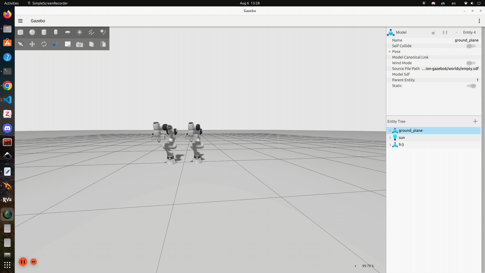
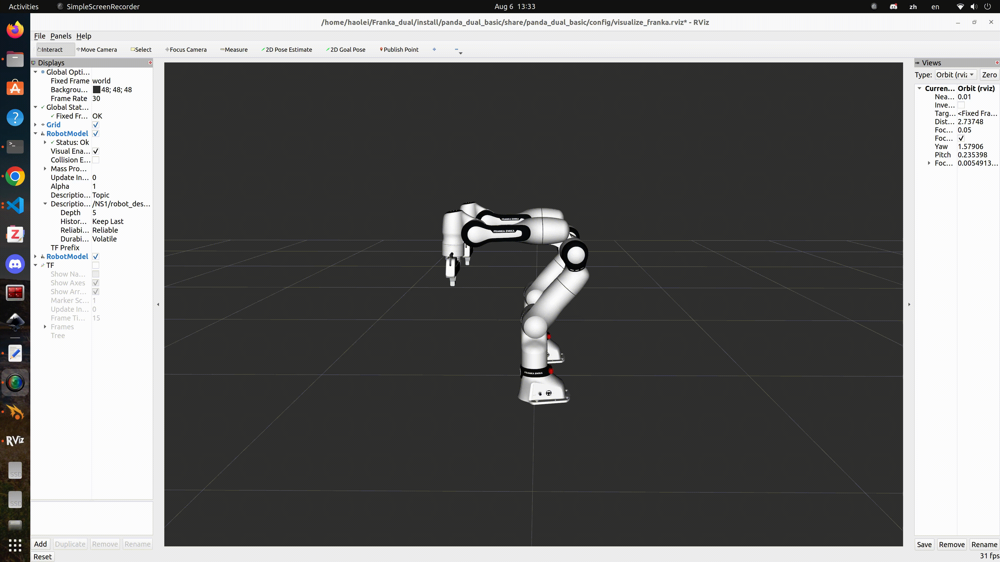
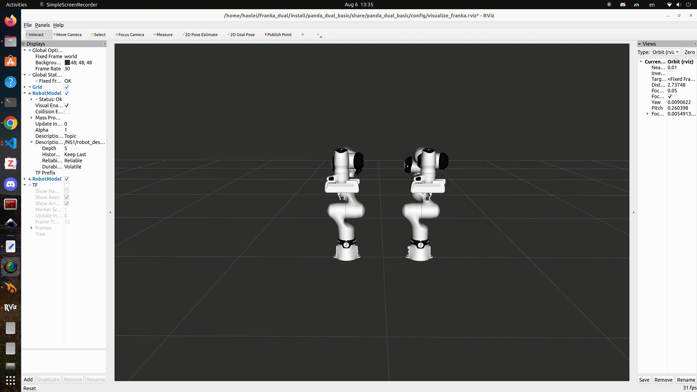
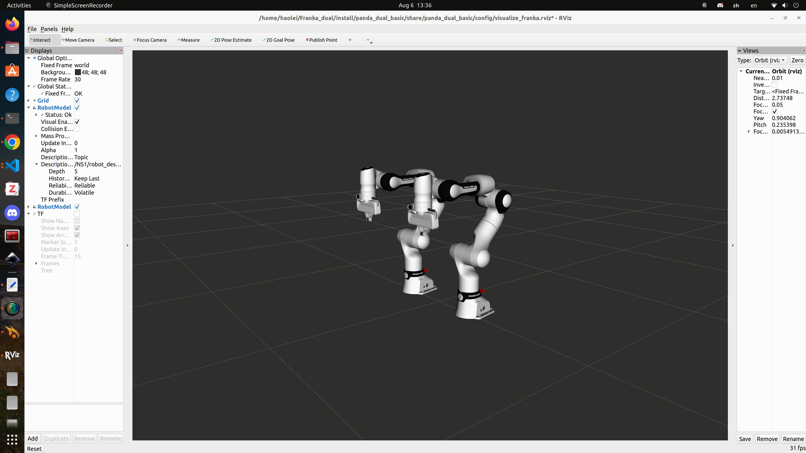

# Dual Franka Simulation (Gazebo and Frankaros2)

### Install & Build
- Install ROS2 Humble[ROS2 Humble](https://docs.ros.org/en/humble/Installation.html)
- Install Franka ros2 package[Franka ros2](https://github.com/frankarobotics/franka_ros2)
- Install Theseus-ai[Theseus-ai](https://github.com/facebookresearch/theseus)
- Git clone this repo`git clone --recursive https://github.com/ThomassTon/Franka_dual.git`

- ```
    cd Franka_dual
    source ~/franka_ros2_ws/install/setup.bash
    colcon build
    source install/setup.bash
  ```
### Spawn dual franka in gazebo and rviz
- `ros2 launch panda_dual_basic dual_franka_gz.launch.py robot_config_file:=src/panda_dual_basic/config/franka_dual_gz.config.yaml`

### Sine Waves
- `ros2 launch franka_dual_arm_sine_wave sin_wave_task.launch.py`

### Move to predefined joint space configurations
- `ros2 launch dual_arm_motion_planner join_target_task.launch.py `

### Move to predefined EEF poses 
- `ros2 launch dual_arm_motion_planner ee_target_task.launch.py`

### TCP motion
- `ros2 launch dual_arm_motion_planner tcp_target_task.launch.py`

### EEF collision avoidance
- `ros2 launch dual_arm_motion_planner cartesian_collision_task.launch.py`


### Notes
- Due to the namespace problem of Gazebo, two franka arms are written into one urdf file.
- Currently, no collision model has been established. Only sphere modeling and collision avoidance are performed on EEF.
- No real robot testing was conducted.
- The controller is rewritten based on the example in frankaros2, and some functions are not yet complete.
- It seems that due to Gazebo, the cartesian vel/pos controller cannot be implemented. The reason is that the frank hardware in Gazebo cannot load the relevant components.